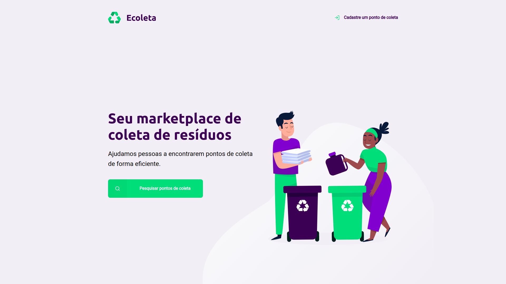
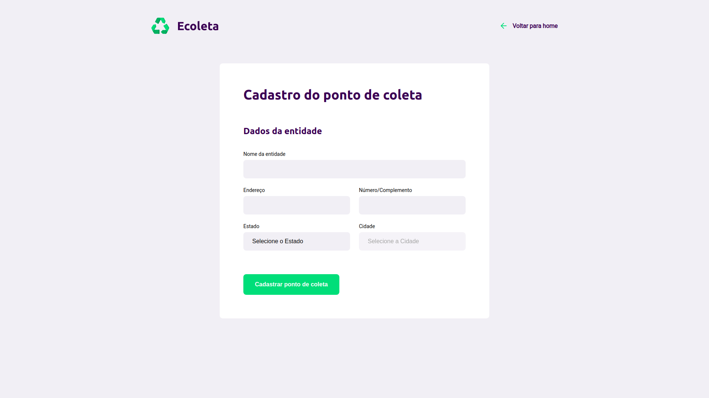

# Ecoleta

## 🗒️ Sobre a aplicação

O projeto **Ecoleta** desenvolvido durante a **Next Level Week** é uma aplicação para ajudar pessoas a encontrar pontos de coleta de resíduos de forma mais eficiente, ajudando no descarte correto destes ítens e assim visando preservar o meio ambiente.

## 🔥 Prévia da aplicação

Tela principal

Tela de cadastro

## 🔨 Iniciando a aplicação

## ...
